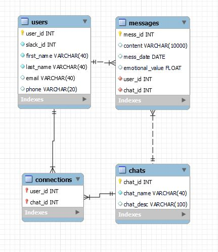

# Sentiment Analysis API project:

The goal of this project is to create an API with sentiment analysis. This API has to be able to receive messages from different groups and users and store them into a MySQL database. Also, this API has to be able to provide these messages through queries and calculate each user and group sentiment value associated to their messages.

At the end of this README there is the API documentation to use it!

This project has four stages defined:
1. MySQL database structure and tables creation 
2. New API creation 
3. Connecting API y MySQL to use GET and POST methods
4. Sentiment analysis of messages

## Files structure:

- "config" folder with:
    - Python file (config.py) with all the basic configurations to connect to MySQL.
- "mysql" folder: 
    - SQL file (create_db.sql): MySQL file to create from zero the database necesary for this project.
    - SQL file (test_data.sql): MySQL file to create some dummy data in our db.
    - SQL file (test_queries.sql): MySQL file used to test some query and how the db and the tables were working.
- "tools" folder with:
    - Python file (get_functions.py): File with all API GET functions.
    - Python file (post_functions.py): File with all API POST functions.
    - Python file (sia_functions.py): File with all Sentiment Analysis functions.
- "image" folder with:
    - Coverpage image (spider-crying.jpg)
    - Schema of MySQL database structure (db_schema.jpg)
- Python file (new_api.py): File with API intialization.
- Jupyter notebook file (testing.py): File with different responses tests of the API.

## Libraries used:

- [Pandas](https://pandas.pydata.org/)
- [Sqlalchemy](https://www.sqlalchemy.org/)
- [Flask](https://flask.palletsprojects.com/en/2.0.x/)
- [JSON](https://docs.python.org/3/library/json.html)
- [Requests](https://docs.python-requests.org/en/master/)
- [Dotenv](https://pypi.org/project/python-dotenv/)
- [Langdetect](https://pypi.org/project/langdetect/)
- [Googletrans](https://py-googletrans.readthedocs.io/en/latest/)
- [Spacy](https://spacy.io/)
- [Regex](https://docs.python.org/3/library/re.html)
- [NLTK](https://www.nltk.org/)

## DB used:

- [MySQL](https://www.mysql.com/)

### MySQL Structure:

# API Documentation:

## GET Endpoints:

- "/messages": It provides you all messages information.
- "/users": It provides you all users information.
- "/chats": It provides you all chats information.
- "/messages/<chat_id>/<user_id>": It provides you an specific user messages send in an specific chat.
- "/sia/users": It provides you each users sentiment analysis base of their messages.
- "/sia/user/<user_id>": It provides you an specific users sentiment analysis base of their messages.
- "/sia/chats": It provides you all chats sentiment analysis base of their messages.
- "/sia/chat/<chat_id>": It provides you an specific chat sentiment analysis base of their messages.

## POST Endpoints:

- "/create_chat/<chat_name>": It creates a new chat with the name specified.
- "/create_user": It creates in the db a new user where you have to specify with a dictionary {"slack_id": INT, "first_name": STRING, "last_name": STRING}
- "/create_message": It creates in the db a new message where you have to specify with a dictionary {"chat_id": INT, "user_id": INT, "content": STRING}
- "/user_to_chat": It joins a user to a chat you have to specify with a dictionary {"chat_id": INT, "user_id": INT}